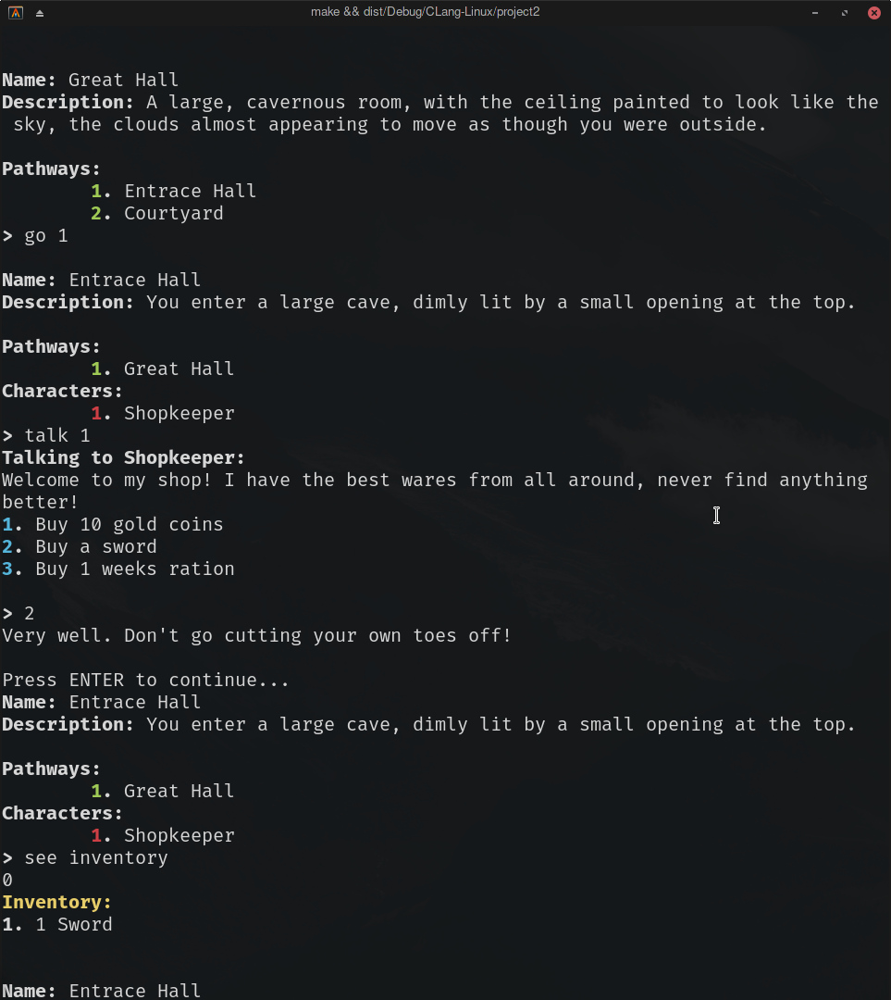

# Introduction
For this project, I decided to make a basic framework for building a text adventure role playing game. The framework includes functions and classes to setup the map, add characters and dialogue, manage a basic inventory, and use anonymous lambda functions to provide custom functionality, as well as a simple demo game which showcases all of these features.

Like most text-adventure games, it can be played in a terminal, with the user inputting basic commands like `go 1`, to go to the room through doorway 1, or `see inventory` to see the contents of their inventory.


The development took about one week. Altogether, the code is 832 lines, comprised of nearly 400 lines of C header files and abut 440 lines of C++ code. These make up 8 separate classes, as well as a handful of standalone functions. 

The code can be found on Github [https://github.com/ritobanrc/DataStructProject2](https://github.com/ritobanrc/DataStructProject2).

# Approach to Development
From the beginning, I knew that I wanted to bring in several of the other classes that I've developed over the semester, particularly my `HashTable` and implementation of `mergeSort`, and the `Display` and `Color` utilities developed for my previous project. Then, much like the previous project, I systematically went through each feature. I started with the room graph, and then characters and dialogue, and then the inventory system.

Throughout this, I tried to commit the code to Github often, ideally after each feature was developed, so I could easily roll back if something broke, or make a branch to work on a different feature for some time.

# Game Rules

The game features several commands that the player can use. 

 `go <pathway number>` -- use a pathway to go to a room
 `talk <character number>` -- initiate a conversation with a character
 `see invetory` -- see the contents of your inventory
 `exit` -- exit the game
 `help` -- show this help screen

# Description of Code
The code is organized into several classes, each with distinct roles.

* World
    - Contains the room graph and helper methods for working with it. The graph is stored as an adjacency list, with as a map between `Room*` and lists of `Room*`s:  `std::map<Room*, std::list<Room*>>`
* Room
    - Represents a Room, which has a name and a description, and can contain one or more characters. 
* Character
    - Represents a character, which has a name and a dialogue tree.
* DialogueTree
    - Represents a DialogueTree, with each level of the tree possible having multiple children stored in a vector.
* Inventory
    - Includes code for the players inventory, stored as a `HashTable<std::string>`.
* HashTable
    - My underlying hash table implementation that backs the inventory, adapted from a previous assignment. It uses the FNV hashing algorithm, uses chaining to handle collisions, and is templates so it can be used with anything can be .hashed.
* Color
    - The utility class I developed for project 1 that handles writing colored output to the terminal
* Display
    - A collection of several helper functions for displaying text to the screen with various formatting.

# Sample

A sample gameplay: 

```
Welcome to The Game!

Name: Great Hall
Description: A large, cavernous room, with the ceiling painted to look like the sky, the clouds almost appearing to move as though you were outside.

Pathways:
	1. Entrace Hall
	2. Courtyard
> help
Help: 	 `go <pathway number>` -- use a pathway to go to a room
	 `talk <character number>` -- initiate a conversation with a character
	 `see invetory` -- see the contents of your inventory
	 `exit` -- exit the game
	 `help` -- show this help screen


Name: Great Hall
Description: A large, cavernous room, with the ceiling painted to look like the sky, the clouds almost appearing to move as though you were outside.

Pathways:
	1. Entrace Hall
	2. Courtyard
> go 1

Name: Entrace Hall
Description: You enter a large cave, dimly lit by a small opening at the top.

Pathways:
	1. Great Hall
Characters:
	1. Shopkeeper
> talk 1
Talking to Shopkeeper:
Welcome to my shop! I have the best wares from all around, never find anything better!
1. Buy 10 gold coins
2. Buy a sword
3. Buy 1 weeks ration

> 2
Very well. Don't go cutting your own toes off!

Press ENTER to continue...
Name: Entrace Hall
Description: You enter a large cave, dimly lit by a small opening at the top.

Pathways:
	1. Great Hall
Characters:
	1. Shopkeeper
> see inventory
0
Inventory:
1. 1 Sword
```

Screenshot: 



## Check-off Sheet
* Recursions
    - Recursion is used in `DialogueTree::Show`, to recursively traverse the dialogue tree as the user selects various options while talking to a character
* Recursive Sorts
    - Merge sort is used in `Inventory::Show` to sort the inventory before displaying it to the user.
* Hashing
    - The `Inventory` is backed by a `HashTable`, implemented in the `HashTable.h` file.
* Trees
    - The `DialogueTree` is a tree. Each node has a `std::string line`, containing the actual text, a `std::vector<std::pair<std::string, DialogueTree>> options`, essentially containing all of the child nodes, paired with what the user needs to say in order to go to that child node, and a `std::function<void()> action`, a callback which will be called when this line is presented, allowing it to have side effects -- like adding something to the inventory.
* Graphs
    - The rooms are modelled as an adjacency list, `std::map<Room*, std::list<Room*>>`, which is just a map between room pointers and linked lists of nodes that they have pathways to.
